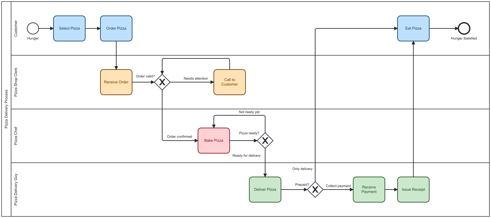

# BPMNFlow Spring Boot Demo

> A runnable Spring Boot application that demonstrates the [bpmnflow-spring-boot-starter](https://github.com/jefersonferr/bpmnflow-spring-boot-starter) — parse any BPMN model at startup, navigate it at runtime, and hot-swap it without restarting.


---

## Table of Contents

- [What this demo shows](#what-this-demo-shows)
- [Prerequisites](#prerequisites)
- [Running the application](#running-the-application)
- [Example model — Pizza Delivery](#example-model--pizza-delivery)
- [API endpoints](#api-endpoints)
- [Project structure](#project-structure)
- [How it works](#how-it-works)

---

## What this demo shows

This demo illustrates the core value proposition of BPMNFlow: **a Spring Boot application that navigates workflow transitions without any hardcoded business logic**. All routing decisions come from the active BPMN model at runtime.

Specifically it demonstrates:

- Zero-config startup — the BPMN model and config are loaded automatically via the starter
- `ProcessController` — generic navigation endpoints that work with any active BPMN model
- Hot-swap — upload a new `.bpmn` file at runtime via `POST /process/model` and all endpoints immediately reflect the new model
- **API handler activities** — service tasks configured with `bpmnflow:apiHandler` definitions are visible at `GET /process/activities` (with `apiHandler` block) and `GET /process/api-activities` (filtered list)
- Swagger UI with full OpenAPI documentation

---

## Prerequisites

- Java 17+
- Maven 3.8+

---

## Running the application

```bash
git clone https://github.com/jefersonferr/bpmnflow-spring-boot-demo.git
cd bpmnflow-spring-boot-demo
mvn spring-boot:run
```

The application starts on port `8080`. Swagger UI is available at:

```
http://localhost:8080/swagger-ui.html
```

---

## Example model — Pizza Delivery

The demo ships with `pizza-delivery.bpmn`, a complete end-to-end pizza delivery process modelled in BPMN 2.0 and fully annotated with BPMNFlow extension properties.



### Process overview

The model covers four participants across four swim lanes, connected by three exclusive gateways:

| Stage | Code | Lane | Activities |
|---|---|---|---|
| Customer | `CS` | Customer | Select Pizza, Order Pizza, Eat Pizza |
| Shop Clerk | `SC` | Pizza Shop Clerk | Receive Order, Call to Customer |
| Chef | `CH` | Pizza Chef | Bake Pizza |
| Delivery | `DL` | Pizza Delivery Guy | Deliver Pizza, Receive Payment, Issue Receipt |

### Flow description

1. The customer selects and orders a pizza — triggering the `NEW` process status from the `StartEvent`
2. The clerk receives the order and evaluates it at the **Order valid?** gateway:
   - **Needs attention** (`PENDING`) — clerk calls the customer, who loops back to the gateway
   - **Order confirmed** (`IN_PREPARATION`) — pizza goes to the chef
3. The chef bakes the pizza and evaluates readiness at the **Pizza ready?** gateway:
   - **Not ready yet** (`IN_PREPARATION`) — bake again
   - **Ready for delivery** (`OUT_FOR_DELIVERY`) — pizza goes to the delivery guy
4. The delivery guy delivers and evaluates payment at the **Prepaid?** gateway:
   - **Collect payment** — receives payment and issues receipt, then customer eats
   - **Only delivery** — customer goes straight to eating
5. Customer eats and the process ends at `Hunger Satisfied` with status `CLOSED`

### Extension properties summary

| Element | Property | Value |
|---|---|---|
| Process | `process_type` | `FD` (Food Delivery) |
| Process | `process_subtype` | `DLV` (Delivery) |
| StartEvent | `process_status` | `NEW` |
| EndEvent | `process_status` | `CLOSED` |
| Gateway flow | `conclusion` | `ORDER_CONFIRMED`, `NEEDS_ATTENTION`, `READY_FOR_DELIVERY`, `NOT_READY`, `COLLECT_PAYMENT`, `ONLY_DELIVERY` |

### Editing the model

The model file can be opened and edited with [Camunda Modeler](https://camunda.com/download/modeler/). To add or modify extension properties, open any element in the modeler, go to the **Properties Panel** → **Extension Properties** → click **+**.

BPMNFlow supports both **Camunda 7** and **Camunda 8** models. The target engine is declared in `bpmn-config.yaml` via the `engine` field:

```yaml
bpmn_model_parser:
  engine: camunda7   # or camunda8
```

- **Camunda 7** models use `<camunda:property>` elements for extension properties
- **Camunda 8** models use `<zeebe:property>` elements for extension properties

The shipped `pizza-delivery.bpmn` uses the Camunda 7 format (`engine: camunda7` in `bpmn-config.yaml`). To use a Camunda 8 model, upload it via `POST /process/model` and update `bpmn-config.yaml` to `engine: camunda8`.

### Using a different model

You can replace the active model at runtime without restarting:

```bash
curl -X POST http://localhost:8080/process/model \
  -F "file=@your-process.bpmn"
```

All `/process/**` endpoints will immediately reflect the new model.

---

## API endpoints

### Process (generic navigation)

| Method | Path | Description |
|---|---|---|
| `POST` | `/process/open?caseId={id}` | Opens a new process instance — entry activity and status resolved from the active BPMN model |
| `GET` | `/process/transition?from={abbreviation}` | Returns all possible next steps from a given activity |
| `GET` | `/process/guide` | Returns a full process guide — every activity and its outgoing transitions |

### Workflow inspection (from the starter)

| Method | Path | Description |
|---|---|---|
| `POST` | `/process/model` | Upload a new `.bpmn` file to replace the active model at runtime |
| `GET` | `/process/info` | Workflow metadata: name, version, type, health summary |
| `GET` | `/process/validate` | Validation result and list of inconsistencies |
| `GET` | `/process/activities` | All activities — plain tasks and API service tasks |
| `GET` | `/process/api-activities` | Only activities configured as API handler service tasks |
| `GET` | `/process/activities/{abbreviation}` | Single activity by abbreviation |
| `GET` | `/process/activities/{abbreviation}/next` | Outgoing transitions from a given activity |
| `GET` | `/process/stages` | All stages declared in the workflow lanes |
| `GET` | `/process/rules` | All workflow rules (transitions) |
| `GET` | `/process/rules/by-status?status={status}` | Rules triggered by a given process status |

### API handler activities

Service tasks configured with a `bpmnflow:apiHandler` extension element appear in
`GET /process/activities` with an additional `apiHandler` block:

```json
{
  "stageCode": "SC",
  "activityCode": "PMT",
  "name": "Process Payment",
  "abbreviation": "SC-PMT",
  "apiHandler": {
    "connectorId": "payment-api",
    "endpoint": "https://api.example.com/v1/charge",
    "method": "POST",
    "retries": 0,
    "taskHeaders": [],
    "inputMappings": [{ "key": "payload", "value": "{\"amount\": ${{var.amount}}}" }],
    "outputMappings": [{ "key": "txn_id", "value": "$.transaction_id" }]
  },
  "conclusions": [...]
}
```

`GET /process/api-activities` returns only the activities that carry an `apiHandler`
block — equivalent to filtering the full list to `ApiActivityNode` instances.

---

## Project structure

```
src/main/
├── java/org/bpmnflow/demo/
│   ├── DemoApplication.java       ← Spring Boot entry point
│   ├── SwaggerConfig.java         ← OpenAPI / Swagger UI configuration
│   └── ProcessController.java     ← Generic process navigation endpoints
└── resources/
    ├── application.yaml           ← Server config and bpmnflow properties
    ├── bpmn-config.yaml           ← Validation/extraction rules for the BPMN parser
    ├── pizza-delivery.bpmn        ← Example BPMN model (Pizza Delivery process)
    └── pizza-delivery.png         ← Diagram image of the example model
```

---

## How it works

The starter (`bpmnflow-spring-boot-starter` **3.2.2**) auto-configures a `WorkflowEngine`
bean by parsing `pizza-delivery.bpmn` against `bpmn-config.yaml` at startup. The
`ProcessController` injects `AtomicReference<WorkflowEngine>` — the same shared reference
managed by the starter — so every request always resolves to the currently active engine.

**Open a process instance** — finds all `START_TO_TASK` rules in the active model and
resolves the entry activity and initial status directly from the `StartEvent`, without
requiring any input from the caller.

**Resolve transitions** — calls `nextSteps(abbreviation)` to get every outgoing path from
the current activity, including the conclusion code, resulting process status, and target
activity.

**Generate a process guide** — iterates all activities and maps each one to its available
exits — useful for populating UI flows or feeding a decision engine without any hardcoded
logic.

**Hot-swap the model** — upload any `.bpmn` file via `POST /process/model` and all
`ProcessController` endpoints immediately reflect the new model without restarting.

**Inspect API handler activities** — `GET /process/activities` serializes `ApiActivityNode`
instances with a full `apiHandler` block via the Jackson MixIn registered by the starter.
`GET /process/api-activities` filters the list to only those entries.

In a production system these endpoints would be backed by a database of case instances.
Here they are stateless to keep the demo self-contained and focused on the BPMNFlow
integration.

---

## License

MIT — see [LICENSE](LICENSE).